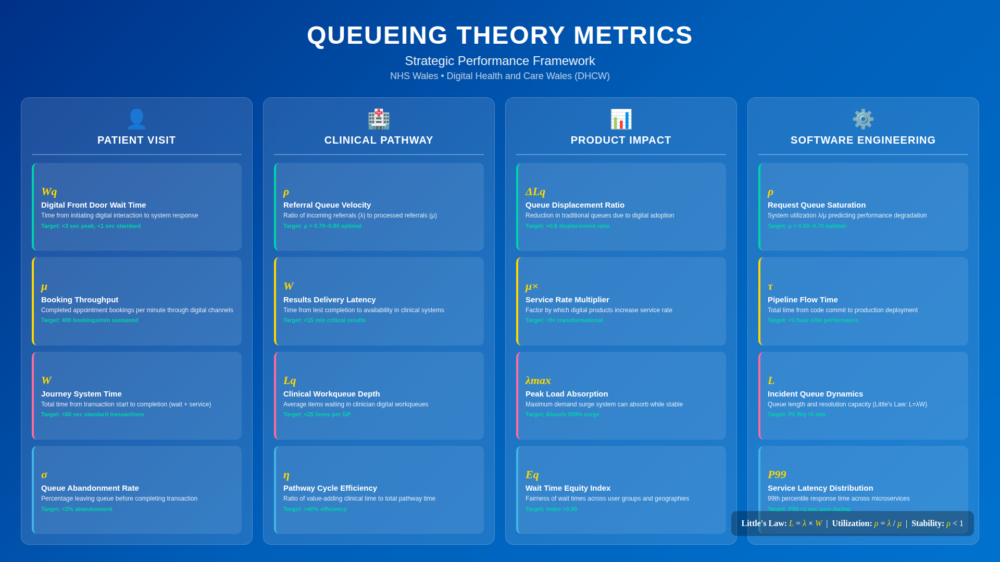
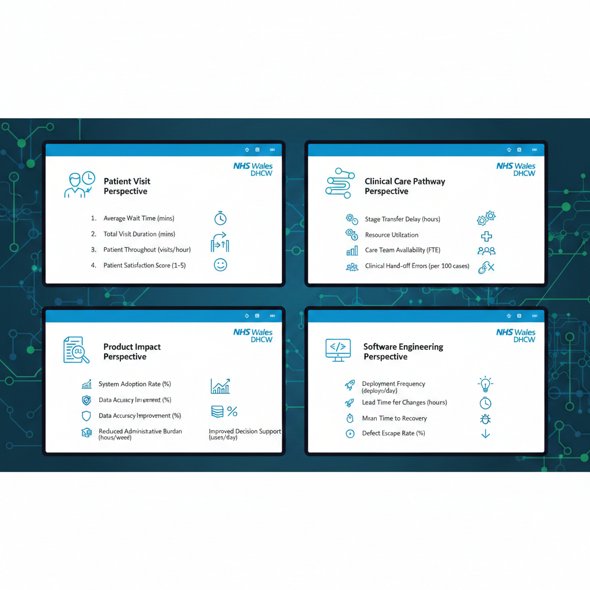

# Queueing theory

THIS IS AI GENERATED. THIS IS FAKE NOT REAL.

## AI prompt

```txt
Create queueing theory metrics for NHS Wales DHCW.
https://github.com/joelparkerhenderson/queueing-theory
- Patient visit perspective with top 4 metrics.
- Clinical care pathway perspective with top 4 metrics.
- Product impact perspective with top 4 metrics.
- Software engineering perspective with top 4 metrics.
```

## Claude Opus 1080p



## Gemini Nano Banana



## QUEUEING THEORY METRICS

Contents
1. Introduction to Queueing Theory in Digital Health
2. Patient Visit Perspective
3. Clinical Care Pathway Perspective
4. Product Impact Perspective
5. Software Engineering Perspective
6. Measurement and Application Guide

### INTRODUCTION TO QUEUEING THEORY IN DIGITAL HEALTH

Queueing theory provides mathematical models to analyse waiting lines, system
capacity, and service delivery. For DHCW, these metrics help optimise digital
systems that support patient flow, clinical pathways, and technical operations.


| λ (Lambda)   | Arrival Rate  | Rate at which requests/patients enter the system |
| μ (Mu)       | Service Rate  | Rate at which requests/patients are processed    |
| ρ (Rho)      | Utilisation   | System load = λ/μ (should be <1 for stability)   |
| Wq           | Wait Time     | Average time spent waiting before service        |
| W            | System Time   | Total time in system (wait + service)            |
| Lq           | Queue Length  | Average number of items waiting                  |
| L            | System Length | Average number in entire system                  |
| Little's Law | L = λW        | Fundamental relationship linking these metrics   |

### STABILITY PRINCIPLE

A system is stable when arrival rate < service rate (λ < μ, or ρ < 1).

When ρ approaches 1, wait times grow exponentially. DHCW targets ρ < 0.8 for critical systems to maintain responsive service levels.

## PATIENT VISIT PERSPECTIVE

These metrics measure the patient experience when interacting with NHS Wales digital services, from initial access through to completed transaction.

### DIGITAL FRONT DOOR WAIT TIME (Wq)

Definition
- Average time patients wait from initiating a digital interaction to receiving system response or being connected to the appropriate service.

Formula
- Wq = Lq / λ

Where:
- Lq = Average number of patients in digital queue
- λ  = Patient arrival rate (requests per minute)

Measurement Points
- NHS Wales App login to home screen load
- Video consultation waiting room duration
- Online booking system response time
- Patient portal query submission to acknowledgement

Target Performance
- Peak Hours (09:00-11:00, 14:00-16:00):    Wq < 3 seconds
- Standard Hours:                            Wq < 1 second
- Degraded Service Threshold:                Wq > 10 seconds triggers alert

Application
- Monitor real-time queue depths during peak demand periods. 
- When Wq exceeds thresholds, trigger auto-scaling or load balancing to maintain patient experience standards.

### APPOINTMENT BOOKING THROUGHPUT (μ)

Definition
- Service rate measuring completed appointment bookings per unit time through digital channels, indicating system capacity to handle patient demand.

Formula
- μ = Completed Bookings / Time Period

With effective capacity:
- μ_effective = μ × (1 - Error Rate) × Availability

Measurement Points
- GP appointment bookings via NHS Wales App
- Outpatient appointment self-scheduling
- Vaccination appointment bookings
- Diagnostic test appointment requests

Target Performance
- System Capacity:           500 bookings per minute
- Sustained Throughput:      400 bookings per minute (80% utilisation)
- Minimum Acceptable:        200 bookings per minute

Application
- Capacity planning for campaign periods (e.g., flu vaccination rollout) and identifying bottlenecks in the booking workflow.
- Compare μ across different booking types to identify optimisation opportunities.

### PATIENT JOURNEY SYSTEM TIME (W)

Definition
- Total time from patient initiating a digital health transaction to successful completion, including all waiting and processing steps.

Formula
- W = Wq + Service Time
- W = 1 / (μ - λ)  for M/M/1 queue model

Little's Law Application:
- L = λ × W (Average patients in system = arrival rate × system time)

Measurement Points
- End-to-end appointment booking journey
- Prescription request to confirmation
- Test results request to display
- Referral submission to acknowledgement

Target Performance by Transaction Type
- Simple Query (e.g., view record):          W < 5 seconds
- Standard Transaction (e.g., booking):      W < 60 seconds
- Complex Transaction (e.g., registration):  W < 180 seconds

Application
- Identify which journey stages contribute most to system time. 
- Use Little's Law to predict queue lengths during peak periods and plan capacity accordingly.

### PATIENT QUEUE ABANDONMENT RATE

Definition
- Percentage of patients who leave the digital queue before completing their intended transaction, indicating service level failure.

Formula
- Abandonment Rate = (Arrivals - Completions - In Progress) / Arrivals × 100

With patience threshold modelling:
- P(Abandon) = f(Wq, Patient Patience Threshold)

Measurement Points
- Incomplete appointment bookings (session timeout)
- Video consultation waiting room exits
- Form submissions abandoned mid-process
- App sessions ended without transaction completion

Target Performance
- Excellent:                  < 2% abandonment
- Acceptable:                 2-5% abandonment
- Action Required:            5-10% abandonment
- Critical:                   > 10% abandonment

Application
- Correlate abandonment rates with wait times to establish patience thresholds. 
- Implement queue position indicators and estimated wait time displays to reduce perceived wait time and improve completion rates.

## CLINICAL CARE PATHWAY PERSPECTIVE

These metrics apply queueing theory to clinical workflows enabled by DHCW digital systems, optimising patient flow through care pathways.

### REFERRAL QUEUE VELOCITY (λ/μ RATIO)

Definition
- Ratio of incoming electronic referrals to processed referrals, measuring the flow efficiency of the digital referral system and downstream capacity.

Formula
- Queue Velocity (ρ) = λ_referrals / μ_processing

Where:
- λ_referrals = Incoming referrals per day via e-RS
- μ_processing = Referrals triaged and actioned per day

Stability Analysis:
- ρ < 0.7:  Healthy flow, capacity headroom
- ρ 0.7-0.9: Monitor closely, approaching capacity
- ρ > 0.9:  Backlog risk, intervention required
- ρ ≥ 1.0:  Unstable, queue growing indefinitely

Measurement Points
- GP to specialist e-referrals
- Inter-specialty referrals
- Diagnostic test requests
- Community care referrals

Target Performance
- Optimal Utilisation:        ρ = 0.70-0.80
- Maximum Sustainable:        ρ = 0.85
- Alert Threshold:            ρ > 0.90

Application
- Early warning system for pathway bottlenecks. 
- When ρ approaches 0.9 for any pathway, trigger capacity review with relevant Health Board. 
- Enables proactive resource allocation before backlogs develop.

### DIAGNOSTIC RESULTS DELIVERY LATENCY (W)

Definition
- System time from diagnostic test completion to results availability in clinical systems, measuring information flow through the care pathway.

Formula
- W_results = T_lab_release + T_integration + T_notification

Queue Components:
- Lq_integration = λ_results × Wq_integration (Number of results waiting in integration queue)

Measurement Points
- Laboratory results to Welsh Clinical Portal
- Radiology reports to requesting clinician
- Pathology results to GP systems
- Point-of-care test results to EPR

Target Performance by Result Type
- Critical/Urgent Results:     W < 15 minutes
- Routine Laboratory:          W < 2 hours
- Radiology Reports:           W < 24 hours
- Histopathology:              W < 5 days

Application
- Identify integration bottlenecks affecting clinical decision-making. 
- Model queue behaviour during high-volume periods (Monday mornings, post-weekend) to ensure adequate integration capacity.

### CLINICAL WORKQUEUE DEPTH (Lq)

Definition
- Average number of items waiting in clinician digital workqueues (tasks, results, messages), indicating workflow load and system effectiveness.

Formula
- Lq = λ² / (μ × (μ - λ))  (for M/M/1 queue)

Or measured directly:
- Lq = Σ(Queue Items) / Number of Workqueues

With ageing analysis:
- Lq_overdue = Items where Wait Time > SLA Target

Measurement Points
- Results awaiting review in Welsh Clinical Portal
- Electronic tasks pending action
- Clinical correspondence awaiting signature
- Prescription requests awaiting authorisation

Target Performance
- GP Workqueue Average:        Lq < 25 items per clinician
- Hospital Workqueue:          Lq < 50 items per clinician
- Overdue Items:               Lq_overdue < 5% of total
- Maximum Acceptable:          Lq < 100 items

Application
- Workload balancing across clinical teams.
- Identify clinicians or specialties with excessive queue depth for workload redistribution. 
- Monitor Lq trends to predict capacity requirements.

### CARE PATHWAY CYCLE EFFICIENCY

Definition
- Ratio of value-adding time to total pathway time, measuring how much of the patient's journey involves active care versus waiting in queues.

Formula
- Cycle Efficiency = Value-Add Time / Total Pathway Time × 100

Where:
- Value-Add Time = Σ(Active clinical contact time)
- Total Pathway Time = Σ(Wait times + Service times) = W_total

Queue Impact:
- Efficiency Loss = Σ(Wq) / W_total × 100

Measurement Points
- Cancer pathway (referral to treatment)
- Planned care pathway (referral to procedure)
- Mental health pathway (referral to assessment)
- Diagnostics pathway (request to report)

Target Performance
- Excellent Efficiency:        > 40%
- Acceptable Efficiency:       25-40%
- Improvement Required:        15-25%
- Critical Inefficiency:       < 15%

Application
- Identify pathway stages where patients spend most time waiting (not receiving care). 
- Prioritise digital interventions that reduce wait queues with greatest impact on pathway efficiency. 
- Benchmark across Health Boards.

## PRODUCT IMPACT PERSPECTIVE

These metrics measure how DHCW digital products affect queueing dynamics across NHS Wales, demonstrating value and guiding product development.

### QUEUE DISPLACEMENT RATIO

Definition
- Reduction in traditional channel queues (phone, in-person) attributable to digital product adoption, measuring channel shift effectiveness.

Formula
- Displacement Ratio = ΔLq_traditional / Lq_digital_handled

Where:
- ΔLq_traditional = Reduction in traditional queue length
- Lq_digital_handled = Transactions handled by digital channel

Net Queue Impact:
- Net Impact = (λ_traditional_before - λ_traditional_after) / λ_total

Measurement Points
- GP practice phone queue reduction after app adoption
- Outpatient reception queue changes with self-check-in
- Prescription line volume changes with online requests
- Appointment line reduction with online booking

Target Performance
- High Impact Product:         Displacement Ratio > 0.8
- Moderate Impact:             Displacement Ratio 0.5-0.8
- Low Impact:                  Displacement Ratio 0.3-0.5
- Negligible Impact:           Displacement Ratio < 0.3

Application
- Product prioritisation based on queue displacement potential. 
- Guide investment decisions by comparing displacement ratios across product candidates. 
- Demonstrate ROI through reduced traditional channel costs.

### SERVICE RATE MULTIPLIER (μ ENHANCEMENT)

Definition
- Factor by which digital products increase service rate compared to traditional processes, measuring productivity improvement.

Formula
- Service Rate Multiplier = μ_digital / μ_traditional

Capacity Gain:
- Additional Capacity = (μ_digital - μ_traditional) × Operating Hours

Measurement Points
- e-Prescribing vs paper prescriptions
- Electronic referrals vs fax/letter
- Digital triage vs phone triage
- Automated results delivery vs manual notification

Target Performance
- Transformational:            Multiplier > 5x
- Significant Improvement:     Multiplier 2-5x
- Incremental Improvement:     Multiplier 1.2-2x
- No Improvement:              Multiplier ≤ 1x

Application
- Quantify efficiency gains from digital products for business cases. 
- Identify processes with highest multiplier potential for digitisation. 
- Track μ improvements over product versions to demonstrate continuous improvement.

### PEAK LOAD ABSORPTION CAPACITY

Definition
- System's ability to maintain service levels during demand surges, measured as maximum sustainable arrival rate increase.

Formula
- Absorption Capacity = (μ_max - λ_baseline) / λ_baseline × 100

With elasticity factor:
- μ_elastic = μ_base × (1 + Auto-scale Factor)

Queue Stability Under Load:
- ρ_peak = λ_peak / μ_elastic (must remain < 1)

Measurement Points
- Monday morning appointment booking surge
- Vaccination campaign demand spikes
- Health scare information demand
- Seasonal service increases (winter pressures)

Target Performance
- Excellent Resilience:        Can absorb 300% surge
- Good Resilience:             Can absorb 200% surge
- Adequate Resilience:         Can absorb 100% surge
- At Risk:                     Cannot absorb >50% surge

Application
- Capacity planning for known demand events. 
- Design auto-scaling policies based on absorption requirements. 
- Post-incident analysis of queue behaviour during unplanned surges.

### WAIT TIME EQUITY INDEX

Definition
- Measure of fairness in wait time distribution across different user groups, geographies, and access methods, ensuring equitable digital service.

Formula
- Equity Index = 1 - (σ_wait / μ_wait)

Where:
- σ_wait = Standard deviation of wait times across groups
- μ_wait = Mean wait time across all users

Disparity Ratio:
- Disparity = Wq_disadvantaged_group / Wq_overall

Measurement Points
- Urban vs rural user wait times
- Welsh language vs English service wait times
- Mobile app vs web browser performance
- Accessibility tool user experience times

Target Performance
- Excellent Equity:            Index > 0.90, Disparity < 1.1
- Acceptable Equity:           Index 0.80-0.90, Disparity < 1.25
- Improvement Needed:          Index 0.70-0.80, Disparity < 1.5
- Inequitable Service:         Index < 0.70, Disparity > 1.5

Application
- Identify underserved populations experiencing longer wait times. 
- Guide infrastructure investment to reduce geographic disparities. 
- Ensure digital inclusion by monitoring accessibility user experience. Report on health equity dimensions.

## SOFTWARE ENGINEERING PERSPECTIVE

These metrics apply queueing theory to DHCW's technical operations, optimising system performance, deployment pipelines, and support processes.

### REQUEST QUEUE SATURATION (ρ)

Definition
- System utilisation measuring how close services are to capacity limits, predicting performance degradation and scaling requirements.

Formula
- ρ = λ_requests / μ_capacity

Where:
- λ_requests = Incoming requests per second
- μ_capacity = Maximum requests per second (per server/container)

Multi-server adjustment (M/M/c queue):
- ρ_system = λ / (c × μ)
- where c = number of servers

Measurement Points
- API gateway request rates
- Database connection pool utilisation
- Message queue depths
- Container CPU/memory utilisation

Target Performance
- Optimal Operating Range:     ρ = 0.50-0.70
- Elevated (Scale Warning):    ρ = 0.70-0.85
- Critical (Scale Now):        ρ = 0.85-0.95
- Saturated (Service Impact):  ρ > 0.95

Application
- Auto-scaling trigger thresholds based on utilisation. 
- Capacity planning using ρ trends to predict when additional resources needed. 
- Performance budgeting during architecture decisions.

### DEPLOYMENT PIPELINE FLOW TIME (W)

Definition
- Total time for code changes to flow through the deployment pipeline from commit to production, treating the pipeline as a queueing system.

Formula
- W_pipeline = Σ(Wq_stage + S_stage)

Where:
- Wq_stage = Wait time at each pipeline stage
- S_stage = Service time (actual processing) at each stage

Pipeline Efficiency:
- Flow Efficiency = Σ(S_stage) / W_pipeline × 100

Measurement Points
- Code commit to build start (queue time)
- Build duration (service time)
- Build complete to test start (queue time)
- Test duration (service time)
- Test complete to deployment (queue time)
- Deployment duration (service time)

Target Performance
- Elite Performance:           W < 1 hour
- High Performance:            W < 4 hours
- Medium Performance:          W < 1 day
- Low Performance:             W > 1 day

Application
- Identify pipeline bottlenecks where queue time exceeds service time. 
- Optimise parallel execution to increase μ. 
- Reduce batch sizes to decrease Wq. 
- DevOps improvement prioritisation based on queue analysis.

### INCIDENT QUEUE DYNAMICS

Definition
- Queueing characteristics of the incident management process, measuring response capacity and backlog risk.

Formula
- λ_incidents = Incident arrival rate (per hour/day)
- μ_resolution = Incident resolution rate
- ρ_incident = λ_incidents / (Engineers × μ_per_engineer)

Expected Queue Length:
- Lq = ρ² / (1 - ρ) × √(Ca² + Cs²) / 2

Where 
- Ca, Cs = coefficients of variation for arrivals and service

Measurement Points
- P1 incident arrival patterns
- Mean time to acknowledge (queue time)
- Mean time to resolve (service time)
- Incident backlog (queue length)

Target Performance
- Utilisation Target:          ρ < 0.75 (capacity headroom for surges)
- P1 Queue Time (Wq):          < 5 minutes
- P2 Queue Time (Wq):          < 30 minutes
- Backlog (Lq):                < 10 open incidents per engineer

Application
- On-call staffing decisions based on λ patterns (time of day, day of week).
- Predict queue growth during major incidents.
- Trigger escalation when ρ approaches capacity limits. Post-incident capacity review.

### SERVICE MESH LATENCY DISTRIBUTION

Definition
- Statistical distribution of request latency across microservices, using queueing theory to model and optimise service interactions.

Formula
- P50 = Median response time
- P95 = 95th percentile (tail latency)
- P99 = 99th percentile (worst case typical)

Little's Law Application:
- Concurrent Requests (L) = Throughput (λ) × Response Time (W)

Queue-induced Latency:
- Wq_total = Σ(Wq per service hop)

Measurement Points
- API response times by endpoint
- Database query latency
- Inter-service call latency
- External integration response times

Target Performance
- User-Facing APIs:            P50 < 100ms, P95 < 500ms, P99 < 1s
- Internal Services:           P50 < 50ms, P95 < 200ms, P99 < 500ms
- Database Queries:            P50 < 20ms, P95 < 100ms, P99 < 250ms
- Batch Processing:            P95 < 5s, P99 < 30s

Application
- Identify services contributing most to tail latency. 
- Optimise request routing to reduce queue times. 
- Set timeout values based on P99 latencies.
- Capacity planning using Little's Law to predict concurrency requirements.

## MEASUREMENT AND APPLICATION GUIDE

### DATA COLLECTION REQUIREMENTS

Real-Time Metrics (streaming):
- Request arrival rates (λ)
- System utilisation (ρ)
- Current queue depths (L, Lq)
- Response times (W, Wq)

Aggregated Metrics (periodic):
- Service rates (μ) - hourly/daily averages
- Abandonment rates - daily summaries
- Cycle efficiency - pathway analysis
- Equity indices - weekly/monthly

### RECOMMENDED TOOLING

Metric Collection:
- Prometheus for system metrics (λ, μ, ρ)
- Application Performance Monitoring for latency distribution
- Custom instrumentation for patient journey tracking

Analysis & Visualisation:
- Grafana dashboards for real-time queue monitoring
- Statistical tools for distribution analysis
- Capacity planning models in spreadsheets or Python

Alerting Thresholds:
- ρ > 0.8: Warning (approach capacity)
- ρ > 0.9: Critical (scale immediately)
- Wq > SLA: Service level breach
- Lq growth rate > μ: Queue instability

### QUEUEING MODEL SELECTION

M/M/1 (Single Server):
- Use for: Simple API endpoints, single database connections
- Assumptions: Poisson arrivals, exponential service, one server

M/M/c (Multi-Server):
- Use for: Load-balanced services, pooled resources
- Assumptions: Poisson arrivals, exponential service, c servers

M/G/1 (General Service):
- Use for: Variable processing times, batch operations
- Assumptions: Poisson arrivals, general service distribution

Priority Queues:
- Use for: Incident management, tiered service levels
- Model: Separate queues with preemptive/non-preemptive priority

### APPLYING LITTLE'S LAW

Little's Law (L = λW) is universally applicable and requires no assumptions about arrival or service distributions.

Capacity Planning
- If λ = 100 requests/sec and target W = 200ms
- Then L = 100 × 0.2 = 20 concurrent requests needed

Performance Budgeting
- If L_max = 50 concurrent and λ = 200 requests/sec
- Then W_max = 50/200 = 250ms budget per request

Queue Sizing
- If λ = 1000 messages/min and W_processing = 6 seconds
- Then L = 1000/60 × 6 = 100 messages in queue on average

### GOVERNANCE & REVIEW

- Weekly: Engineering review of ρ trends and latency percentiles
- Monthly: Product impact metrics review with stakeholders
- Quarterly: Clinical pathway queue analysis with Health Boards
- Annually: Model validation and threshold recalibration
