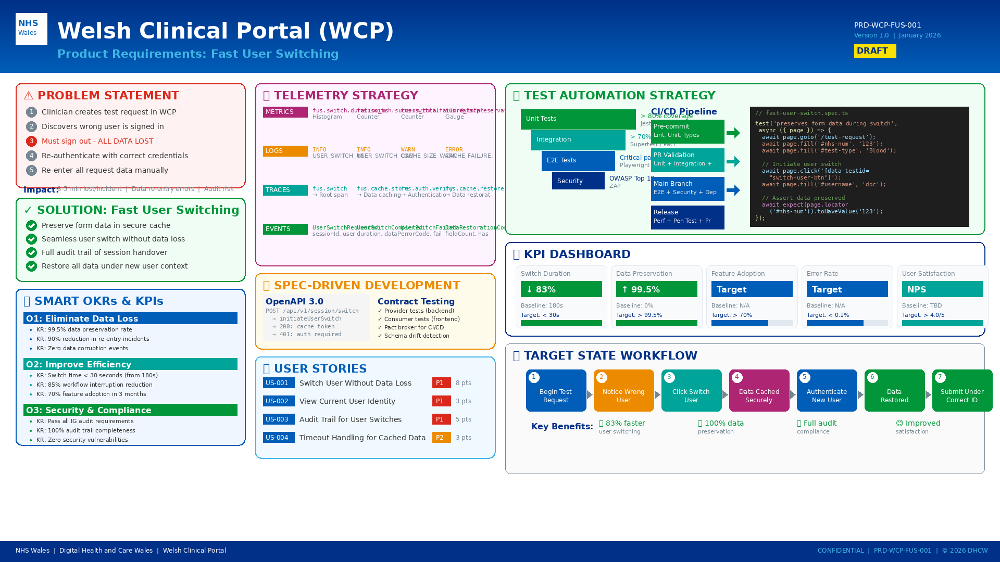
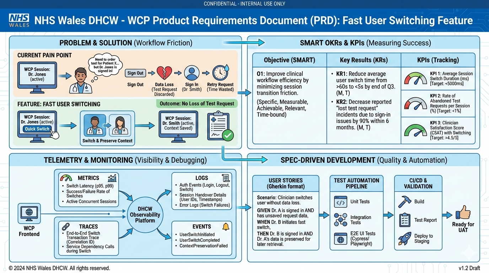

# Welsh Clinical Portal: Fast User Switching

THIS IS AI GENERATED. THIS IS FAKE NOT REAL.

## AI prompt

```txt
Create NHS Wales DHCW product requirements document for feature.
- Product: Welsh Clinical Portal (WCP)
- Problem: A clinician tries to create a test request.
- Problem: But cannot because a different clinician is signed in. 
- Problem: Sign out, lose request, sign in correctly, then retry.
Feature: Fast user switching, so no loss of the test request.
- SMART OKRs KPIs
- Telemetry: metrics, logs, traces, events
- Spec-driven development, user stories, test automation
```

For infographics, we also add this to the start of the prompt:

```txt
Generate image 1080p infographic for business technical presentation.
- PNG image formmat. Not PDF. Not DOCX.
```

## Claude Opus 1080p



## Gemini Nano Banana



## PRODUCT REQUIREMENTS DOCUMENT
                        
Document Information

- Product:            Welsh Clinical Portal (WCP)
- Feature:            Fast User Switching
- Version:            1.0
- Status:             Draft
- Author:             DHCW Product Team
- Date:               January 2026
- Review Date:        February 2026

Stakeholders

- Product Owner:      Clinical Systems Product Manager
- Technical Lead:     WCP Development Lead
- Clinical Lead:      Chief Clinical Information Officer
- Security Lead:      Information Security Officer
- QA Lead:            Quality Assurance Manager

## 1. EXECUTIVE SUMMARY

### 1.1 Problem Statement

Clinicians using the Welsh Clinical Portal frequently encounter a workflow 
disruption when creating electronic test requests. The current system requires 
clinicians to be signed in under their own identity to submit requests. When a 
clinician begins creating a test request while inadvertently signed in as a 
different user (common in shared workstation environments), they must:

  1. Abandon their partially completed test request
  2. Sign out of the current session
  3. Sign in with their own credentials
  4. Navigate back to the patient record
  5. Re-enter all test request information from scratch

This workflow failure results in:
  - Lost clinical work (average 3-5 minutes per incident)
  - Clinician frustration and reduced system trust
  - Potential patient safety risks from rushed re-entry
  - Reduced adoption of electronic requesting

### 1.2 Proposed Solution

Implement a Fast User Switching feature that allows clinicians to authenticate 
as themselves without losing their in-progress work. When the system detects a 
user identity mismatch, or when a clinician initiates a switch, the current 
form state is preserved while a quick re-authentication occurs.

### 1.3 Success Criteria

  - 95% of fast user switches complete in under 10 seconds
  - Zero data loss during user switching
  - 50% reduction in abandoned test requests due to identity mismatch
  - Clinician satisfaction score ≥4.0/5.0 for the feature

## 2. PROBLEM ANALYSIS

### 2.1 Current User Journey (Pain Points)

- Step 1: Clinician A signs into WCP at a shared workstation
- Step 2: Clinician A completes their work and walks away (without signing out)
- Step 3: Clinician B sits down at the same workstation
- Step 4: Clinician B opens a patient record (still signed in as Clinician A)
- Step 5: Clinician B begins creating an electronic test request
- Step 6: Clinician B enters 5-10 fields of clinical information
- Step 7: Clinician B clicks "Submit"
- Step 8: SYSTEM ERROR: "You must be signed in as the requesting clinician"
- Step 9: Clinician B must sign out (LOSING ALL ENTERED DATA)
- Step 10: Clinician B signs in with own credentials
- Step 11: Clinician B navigates back to the patient
- Step 12: Clinician B re-enters all test request information
- Step 13: Clinician B submits successfully

TOTAL TIME LOST: 3-5 minutes per incident

FRUSTRATION LEVEL: High

PATIENT SAFETY RISK: Moderate (rushed re-entry may introduce errors)

### 2.2 Root Causes

- Shared workstations are common in clinical environments
- Session timeout is set to 60 minutes (too long for busy environments)
- No visual indicator of current user identity during form entry
- No mechanism to switch users without losing form state
- Clinicians under time pressure skip identity verification

### 2.3 User Research Findings

- 67% of clinicians report experiencing this issue at least weekly
- 23% report it happens daily
- Average time to re-enter a test request: 4.2 minutes
- 12% of clinicians report submitting requests under wrong identity "to save time"
- 89% would use a fast user switching feature if available

## FEATURE SPECIFICATION

### 3.1 Feature Overview

Fast User Switching enables clinicians to re-authenticate as themselves during 
an active session without losing in-progress form data. The feature operates in 
two modes:

- MODE 1: Proactive Switch
  - Clinician notices they are signed in as wrong user and initiates switch
    
- MODE 2: Reactive Switch  
  - System detects identity mismatch at submission and prompts for switch

### 3.2 Functional Requirements

User Identity Display
- Description:  Display current user identity prominently on all clinical forms
- Acceptance:   User name and role visible in form header at all times

Switch User Button
- Description:  Provide "Switch User" action accessible from clinical forms
- Acceptance:   Button visible and accessible within 1 click from any form field

Form State Preservation
- Description:  Preserve all entered form data during user switch process
- Acceptance:   100% of field values retained after successful switch

Quick Authentication
- Description:  Enable re-authentication without full login flow
- Acceptance:   Authentication completes in <10 seconds via smartcard or password

Identity Mismatch Detection
- Description:  Detect when submitting user differs from intended requestor
- Acceptance:   System prompts for switch before submission when mismatch detected

Session Handoff
- Description:  Transfer patient context to new user session
- Acceptance:   Patient record remains open after switch completes

Audit Trail
- Description:  Log all user switch events with before/after identities
- Acceptance:   Complete audit record for compliance and investigation

Smartcard Support
- Description:  Support NHS smartcard tap for quick re-authentication
- Acceptance:   Smartcard tap completes switch in <5 seconds

PIN/Password Fallback
- Description:  Allow password entry if smartcard unavailable
- Acceptance:   Password authentication available as fallback method

Switch Cancellation
- Description:  Allow user to cancel switch and return to original session
- Acceptance:   Cancel returns to exact previous state with no data loss

### 3.3 Non-Functional Requirements

Performance
- Requirement:  User switch completes in <10 seconds (95th percentile)
- Measurement:  Telemetry on switch duration

Availability
- Requirement:  Feature available 99.9% of time during WCP operational hours
- Measurement:  Feature health check monitoring

Security
- Requirement:  Re-authentication required for every switch (no cached credentials)
- Measurement:  Security audit review

Data Integrity
- Requirement:  Zero data loss during switch process
- Measurement:  Automated testing, production monitoring

Accessibility
- Requirement:  Switch flow meets WCAG 2.1 AA standards
- Measurement:  Accessibility audit

================================================================================
4. USER STORIES
================================================================================

4.1 Epic: Fast User Switching
-----------------------------

EPIC-001: As a clinician, I can switch to my own user account without losing 
my in-progress work, so that I can complete clinical tasks efficiently.

--------------------------------------------------------------------------------
USER STORY 1: View Current Identity
--------------------------------------------------------------------------------

ID:           US-001
Title:        As a clinician, I can see which user I am currently signed in as
Priority:     Must Have
Points:       3

Description:
As a clinician filling out a clinical form, I need to clearly see which user 
account I am currently signed in as, so that I can verify my identity before 
submitting clinical requests.

Acceptance Criteria:
  AC-001.1: Current user's full name is displayed in the form header
  AC-001.2: Current user's role (e.g., "Consultant", "Registrar") is displayed
  AC-001.3: User identity is visible without scrolling on any form
  AC-001.4: Visual styling distinguishes the identity from other form elements
  AC-001.5: Identity display updates immediately after user switch

Test Automation Steps:
  GIVEN I am signed in as "Dr. Jane Smith, Consultant"
  AND I am on the electronic test request form
  WHEN the form loads
  THEN I see "Dr. Jane Smith" displayed in the form header
  AND I see "Consultant" displayed as the role
  AND the identity display is visible without scrolling
  
  GIVEN I switch user from "Dr. Jane Smith" to "Dr. John Doe"
  WHEN the switch completes successfully
  THEN the identity display updates to "Dr. John Doe"
  AND the role updates to reflect Dr. John Doe's role

--------------------------------------------------------------------------------
USER STORY 2: Initiate User Switch
--------------------------------------------------------------------------------

ID:           US-002
Title:        As a clinician, I can initiate a user switch from a clinical form
Priority:     Must Have
Points:       5

Description:
As a clinician who notices I am signed in as the wrong user, I need to be able 
to switch to my own account without navigating away from my current work, so 
that I can correct the identity issue quickly.

Acceptance Criteria:
  AC-002.1: "Switch User" button is visible on clinical forms
  AC-002.2: "Switch User" button is accessible within 1 click from any field
  AC-002.3: Clicking "Switch User" opens the authentication dialog
  AC-002.4: Form data remains visible (but disabled) during switch
  AC-002.5: Authentication dialog supports smartcard and password methods

Test Automation Steps:
  GIVEN I am signed in as "Dr. Jane Smith"
  AND I am on the electronic test request form
  AND I have entered data in the "Test Type" field
  WHEN I look at the form interface
  THEN I see a "Switch User" button in the form header
  
  GIVEN I have entered data in multiple form fields
  WHEN I click the "Switch User" button
  THEN an authentication dialog appears
  AND the form remains visible behind the dialog
  AND all my entered data is still present in the form fields
  AND the form fields are disabled during authentication
  
  GIVEN the authentication dialog is open
  WHEN I view the dialog
  THEN I see an option to authenticate via smartcard
  AND I see an option to authenticate via password

--------------------------------------------------------------------------------
USER STORY 3: Authenticate via Smartcard
--------------------------------------------------------------------------------

ID:           US-003
Title:        As a clinician, I can re-authenticate using my NHS smartcard
Priority:     Should Have
Points:       5

Description:
As a clinician switching users, I need to be able to authenticate quickly using 
my NHS smartcard, so that I can complete the switch in minimal time.

Acceptance Criteria:
  AC-003.1: Authentication dialog displays smartcard prompt
  AC-003.2: System detects smartcard insertion/tap within 2 seconds
  AC-003.3: Smartcard PIN entry is supported
  AC-003.4: Successful authentication completes switch
  AC-003.5: Authentication error displays clear message with retry option

Test Automation Steps:
  GIVEN the authentication dialog is open
  AND I have my NHS smartcard ready
  WHEN I tap or insert my smartcard
  THEN the system detects the card within 2 seconds
  AND I am prompted to enter my PIN
  
  GIVEN I have tapped my smartcard
  AND I am prompted for PIN
  WHEN I enter my correct PIN
  THEN authentication succeeds
  AND the dialog closes
  AND the form updates to show my identity
  AND my entered form data is preserved
  AND the form fields are re-enabled
  
  GIVEN I have tapped my smartcard
  AND I am prompted for PIN
  WHEN I enter an incorrect PIN
  THEN an error message displays "Incorrect PIN. Please try again."
  AND I can retry PIN entry
  AND after 3 failed attempts, I am offered password fallback

--------------------------------------------------------------------------------
USER STORY 4: Authenticate via Password
--------------------------------------------------------------------------------

ID:           US-004
Title:        As a clinician, I can re-authenticate using my password
Priority:     Must Have
Points:       3

Description:
As a clinician without my smartcard available, I need to be able to authenticate 
using my username and password, so that I can still complete the user switch.

Acceptance Criteria:
  AC-004.1: Password option is available on authentication dialog
  AC-004.2: Username field pre-populated if known (e.g., from previous sessions)
  AC-004.3: Password field has secure entry (masked characters)
  AC-004.4: Successful authentication completes switch
  AC-004.5: Failed authentication allows retry with clear error message

Test Automation Steps:
  GIVEN the authentication dialog is open
  WHEN I select the password authentication option
  THEN I see username and password input fields
  
  GIVEN I see the password authentication form
  AND the username field shows "john.doe@wales.nhs.uk"
  WHEN I enter my correct password
  AND I click "Sign In"
  THEN authentication succeeds within 5 seconds
  AND the dialog closes
  AND my identity is updated in the form header
  AND my entered form data is preserved
  
  GIVEN I see the password authentication form
  WHEN I enter an incorrect password
  AND I click "Sign In"
  THEN an error message displays "Incorrect password. Please try again."
  AND the password field is cleared
  AND I can retry

--------------------------------------------------------------------------------
USER STORY 5: Preserve Form Data During Switch
--------------------------------------------------------------------------------

ID:           US-005
Title:        As a clinician, my form data is preserved during user switch
Priority:     Must Have
Points:       8

Description:
As a clinician who has entered data into a clinical form, I need all my entered 
data to be preserved when I switch users, so that I don't have to re-enter 
information.

Acceptance Criteria:
  AC-005.1: All text field values are preserved
  AC-005.2: All dropdown selections are preserved
  AC-005.3: All checkbox/radio selections are preserved
  AC-005.4: All date/time values are preserved
  AC-005.5: Attached files/documents are preserved
  AC-005.6: Clinical notes and free-text are preserved
  AC-005.7: Patient context (selected patient) is preserved

Test Automation Steps:
  GIVEN I am on the electronic test request form
  AND I have entered the following data:
    | Field               | Value                           |
    | Patient             | NHS No: 123-456-7890            |
    | Test Type           | Full Blood Count                |
    | Priority            | Urgent                          |
    | Clinical Notes      | "Patient presenting with..."    |
    | Fasting Required    | Yes (checkbox)                  |
    | Requested Date      | 2026-01-20                      |
  WHEN I initiate a user switch
  AND I authenticate successfully as a different user
  THEN all the above field values remain exactly as entered
  AND the patient context is unchanged
  AND no validation errors appear due to the switch
  
  GIVEN I have attached a clinical document to the request
  WHEN I complete a user switch
  THEN the attached document is still present
  AND I can view the document details

--------------------------------------------------------------------------------
USER STORY 6: Cancel User Switch
--------------------------------------------------------------------------------

ID:           US-006
Title:        As a clinician, I can cancel a user switch in progress
Priority:     Must Have
Points:       2

Description:
As a clinician who initiated a user switch by mistake, I need to be able to 
cancel and return to my original session, so that I can continue working 
without disruption.

Acceptance Criteria:
  AC-006.1: Cancel button visible on authentication dialog
  AC-006.2: Clicking Cancel closes the dialog
  AC-006.3: Original session remains active
  AC-006.4: Form data is unchanged after cancel
  AC-006.5: No audit event logged for cancelled switch

Test Automation Steps:
  GIVEN I have clicked "Switch User"
  AND the authentication dialog is open
  AND I am still signed in as "Dr. Jane Smith"
  WHEN I click the "Cancel" button
  THEN the authentication dialog closes
  AND I remain signed in as "Dr. Jane Smith"
  AND all my form data is unchanged
  AND form fields are re-enabled
  AND I can continue editing the form
  
  GIVEN I have started entering smartcard PIN
  WHEN I click "Cancel"
  THEN the switch is aborted
  AND my original session continues

--------------------------------------------------------------------------------
USER STORY 7: Identity Mismatch Warning at Submission
--------------------------------------------------------------------------------

ID:           US-007
Title:        As a clinician, I am warned if submitting under wrong identity
Priority:     Must Have
Points:       5

Description:
As a clinician submitting a test request, I need the system to warn me if I am 
about to submit under a different user's identity, so that I can switch to my 
own account before submission.

Acceptance Criteria:
  AC-007.1: System compares session user to requestor field
  AC-007.2: Warning dialog appears if mismatch detected
  AC-007.3: Warning clearly explains the identity mismatch
  AC-007.4: User can choose to switch user from warning dialog
  AC-007.5: User can choose to cancel submission
  AC-007.6: User cannot proceed with submission under wrong identity

Test Automation Steps:
  GIVEN I am signed in as "Dr. Jane Smith"
  AND I have entered a test request with requestor "Dr. John Doe"
  WHEN I click "Submit"
  THEN a warning dialog appears before submission
  AND the dialog states "You are signed in as Dr. Jane Smith but this 
      request will be submitted as Dr. John Doe"
  AND I see a "Switch to my account" button
  AND I see a "Cancel" button
  AND there is no option to proceed with mismatched identity
  
  GIVEN the identity mismatch warning is displayed
  WHEN I click "Switch to my account"
  THEN the authentication dialog opens
  AND after successful authentication, the request is submitted

--------------------------------------------------------------------------------
USER STORY 8: Audit Trail for User Switches
--------------------------------------------------------------------------------

ID:           US-008
Title:        As a compliance officer, user switches are logged for audit
Priority:     Must Have
Points:       5

Description:
As a compliance officer, I need all user switch events to be logged with full 
details, so that I can investigate any issues and maintain regulatory compliance.

Acceptance Criteria:
  AC-008.1: Successful switches logged with timestamp
  AC-008.2: Previous user identity logged
  AC-008.3: New user identity logged
  AC-008.4: Patient context logged (NHS number)
  AC-008.5: Form/action context logged
  AC-008.6: Workstation identifier logged
  AC-008.7: Switch method logged (smartcard/password)
  AC-008.8: Failed switch attempts logged separately

Test Automation Steps:
  GIVEN a user switch occurs from "Dr. Jane Smith" to "Dr. John Doe"
  AND the patient is NHS No: 123-456-7890
  AND the form is "Electronic Test Request"
  AND the workstation is "WS-WARD3-01"
  AND the switch used smartcard authentication
  WHEN I query the audit log
  THEN I find a record with:
    | Field              | Value                    |
    | Timestamp          | 2026-01-15T14:32:45Z     |
    | Event Type         | USER_SWITCH_SUCCESS      |
    | Previous User      | Dr. Jane Smith (JS001)   |
    | New User           | Dr. John Doe (JD002)     |
    | Patient NHS Number | 123-456-7890             |
    | Form Context       | Electronic Test Request  |
    | Workstation        | WS-WARD3-01              |
    | Auth Method        | SMARTCARD                |
  
  GIVEN a user switch fails due to incorrect password
  WHEN I query the audit log
  THEN I find a record with Event Type "USER_SWITCH_FAILED"
  AND the failure reason is logged

================================================================================
5. OKRs (OBJECTIVES AND KEY RESULTS)
================================================================================

5.1 Objective 1: Eliminate Lost Work from Identity Issues
---------------------------------------------------------

Objective:
Eliminate clinical work loss caused by user identity mismatches in the Welsh 
Clinical Portal, improving clinician efficiency and system trust.

Key Results:

KR-1.1: Reduce abandoned test requests due to identity mismatch by 80%
  Baseline:     ~200 abandoned requests per week (estimated)
  Target:       <40 abandoned requests per week
  Measurement:  Telemetry on form abandonment with identity mismatch flag
  Timeline:     3 months post-launch

KR-1.2: Achieve 95% of user switches completing in under 10 seconds
  Baseline:     N/A (new feature)
  Target:       P95 switch duration <10 seconds
  Measurement:  Telemetry on switch_duration metric
  Timeline:     Launch + 1 month

KR-1.3: Maintain 100% data preservation rate during user switches
  Baseline:     N/A (new feature)
  Target:       Zero data loss incidents
  Measurement:  QA testing, production error monitoring
  Timeline:     Continuous

KR-1.4: Achieve clinician satisfaction score of 4.0/5.0 for fast user switching
  Baseline:     N/A (new feature)
  Target:       ≥4.0/5.0
  Measurement:  In-app feedback survey post-switch
  Timeline:     3 months post-launch

--------------------------------------------------------------------------------

5.2 Objective 2: Improve Security and Compliance
------------------------------------------------

Objective:
Ensure all clinical submissions are made under correct user identity with full 
audit trail, reducing compliance risk.

Key Results:

KR-2.1: Reduce submissions under incorrect identity to <0.1%
  Baseline:     ~2% estimated (clinicians submitting as others "to save time")
  Target:       <0.1%
  Measurement:  Audit log analysis of submission user vs requestor
  Timeline:     6 months post-launch

KR-2.2: Achieve 100% audit coverage for user switch events
  Baseline:     N/A (no current logging)
  Target:       Every switch attempt logged (success and failure)
  Measurement:  Audit log completeness review
  Timeline:     Launch

KR-2.3: Pass security audit with zero critical findings related to fast switch
  Baseline:     N/A (new feature)
  Target:       Zero critical/high security findings
  Measurement:  Independent security audit
  Timeline:     Pre-launch gate

================================================================================
6. KPIs (KEY PERFORMANCE INDICATORS)
================================================================================

6.1 Primary KPIs
----------------

KPI-001: Switch Success Rate
  Definition:   Percentage of initiated user switches that complete successfully
  Formula:      (Successful Switches / Total Switch Attempts) × 100
  Target:       ≥98%
  Frequency:    Real-time, reported daily
  Owner:        Product Manager
  Alert:        <95% triggers investigation

KPI-002: Switch Duration (P95)
  Definition:   95th percentile time from switch initiation to completion
  Formula:      P95(switch_end_time - switch_start_time)
  Target:       <10 seconds
  Frequency:    Real-time, reported daily
  Owner:        Technical Lead
  Alert:        >15 seconds triggers investigation

KPI-003: Data Preservation Rate
  Definition:   Percentage of switches with zero data loss
  Formula:      (Switches with full data preserved / Total switches) × 100
  Target:       100%
  Frequency:    Real-time, reported daily
  Owner:        QA Lead
  Alert:        <100% triggers immediate investigation

KPI-004: Abandoned Form Reduction
  Definition:   Reduction in forms abandoned due to identity mismatch
  Formula:      (Baseline abandonment - Current abandonment) / Baseline × 100
  Target:       80% reduction
  Frequency:    Weekly
  Owner:        Product Manager
  Alert:        <50% reduction at 2 months triggers review

6.2 Secondary KPIs
------------------

KPI-005: Authentication Method Distribution
  Definition:   Breakdown of switches by authentication method
  Formula:      Count by method (Smartcard, Password)
  Target:       Informational (expect 70% smartcard, 30% password)
  Frequency:    Weekly
  Owner:        Technical Lead

KPI-006: Switch Cancel Rate
  Definition:   Percentage of initiated switches that are cancelled
  Formula:      (Cancelled Switches / Total Switch Attempts) × 100
  Target:       <10%
  Frequency:    Weekly
  Owner:        Product Manager
  Alert:        >20% suggests UX issue

KPI-007: Identity Mismatch Detection Rate
  Definition:   Percentage of submissions where mismatch warning triggered
  Formula:      (Submissions with warning / Total submissions) × 100
  Target:       Decreasing trend over time
  Frequency:    Weekly
  Owner:        Clinical Lead

KPI-008: Feature Adoption Rate
  Definition:   Percentage of eligible clinicians who have used fast switch
  Formula:      (Unique users of feature / Total WCP clinical users) × 100
  Target:       50% within 3 months
  Frequency:    Monthly
  Owner:        Product Manager

================================================================================
7. TELEMETRY SPECIFICATION
================================================================================

7.1 Metrics
-----------

METRIC: user_switch_initiated
  Type:         Counter
  Description:  Number of user switch attempts initiated
  Labels:       auth_method (smartcard, password), form_type, ward, health_board
  Collection:   Increment on switch dialog open
  Retention:    13 months

METRIC: user_switch_completed
  Type:         Counter
  Description:  Number of user switches completed successfully
  Labels:       auth_method, form_type, ward, health_board
  Collection:   Increment on successful authentication
  Retention:    13 months

METRIC: user_switch_failed
  Type:         Counter
  Description:  Number of user switch failures
  Labels:       auth_method, failure_reason, form_type
  Collection:   Increment on authentication failure
  Retention:    13 months

METRIC: user_switch_cancelled
  Type:         Counter
  Description:  Number of user switches cancelled by user
  Labels:       form_type, stage_cancelled (dialog, pin_entry, password_entry)
  Collection:   Increment on cancel action
  Retention:    13 months

METRIC: user_switch_duration_seconds
  Type:         Histogram
  Description:  Time taken to complete user switch
  Buckets:      [1, 2, 3, 5, 7, 10, 15, 20, 30, 60]
  Labels:       auth_method, form_type
  Collection:   Record on switch completion
  Retention:    13 months

METRIC: identity_mismatch_detected
  Type:         Counter
  Description:  Number of times identity mismatch warning shown
  Labels:       form_type, user_action (switched, cancelled)
  Collection:   Increment on warning display
  Retention:    13 months

METRIC: form_data_fields_preserved
  Type:         Gauge
  Description:  Number of form fields preserved during switch
  Labels:       form_type
  Collection:   Record on switch completion
  Retention:    13 months

7.2 Logs
--------

LOG: UserSwitchInitiated
  Level:        INFO
  Fields:
    - timestamp: ISO 8601
    - correlation_id: UUID
    - session_id: Current session identifier
    - previous_user_id: Hashed user identifier
    - form_type: Type of form active
    - patient_nhs_number: Hashed NHS number
    - workstation_id: Workstation identifier
    - ward_code: Ward code
    - health_board_code: Health board code
  Example:
    {
      "timestamp": "2026-01-15T14:32:45.123Z",
      "level": "INFO",
      "event": "UserSwitchInitiated",
      "correlation_id": "abc-123-def-456",
      "session_id": "sess_789xyz",
      "previous_user_id": "hash_user_001",
      "form_type": "ElectronicTestRequest",
      "patient_nhs_number": "hash_nhs_123",
      "workstation_id": "WS-WARD3-01",
      "ward_code": "WARD3",
      "health_board_code": "ABUHB"
    }

LOG: UserSwitchCompleted
  Level:        INFO
  Fields:
    - timestamp: ISO 8601
    - correlation_id: UUID (same as initiated)
    - previous_user_id: Hashed user identifier
    - new_user_id: Hashed user identifier
    - auth_method: smartcard | password
    - duration_ms: Milliseconds to complete
    - fields_preserved_count: Number of form fields preserved
  Example:
    {
      "timestamp": "2026-01-15T14:32:52.456Z",
      "level": "INFO",
      "event": "UserSwitchCompleted",
      "correlation_id": "abc-123-def-456",
      "previous_user_id": "hash_user_001",
      "new_user_id": "hash_user_002",
      "auth_method": "smartcard",
      "duration_ms": 7333,
      "fields_preserved_count": 12
    }

LOG: UserSwitchFailed
  Level:        WARN
  Fields:
    - timestamp: ISO 8601
    - correlation_id: UUID
    - previous_user_id: Hashed user identifier
    - attempted_user_id: Hashed user identifier (if known)
    - auth_method: smartcard | password
    - failure_reason: Code describing failure
    - attempt_number: Which attempt this was
  Failure Reason Codes:
    - INVALID_PIN: Smartcard PIN incorrect
    - INVALID_PASSWORD: Password incorrect
    - CARD_LOCKED: Smartcard locked after too many attempts
    - CARD_NOT_RECOGNISED: Unknown smartcard
    - ACCOUNT_LOCKED: User account locked
    - TIMEOUT: Authentication timed out
    - SYSTEM_ERROR: Unexpected system error

LOG: UserSwitchCancelled
  Level:        INFO
  Fields:
    - timestamp: ISO 8601
    - correlation_id: UUID
    - previous_user_id: Hashed user identifier
    - stage_cancelled: dialog | pin_entry | password_entry
    - time_in_dialog_ms: Time spent before cancelling

LOG: IdentityMismatchDetected
  Level:        WARN
  Fields:
    - timestamp: ISO 8601
    - correlation_id: UUID
    - session_user_id: Hashed current session user
    - requestor_user_id: Hashed intended requestor
    - form_type: Type of form
    - user_action: switch_initiated | cancelled

7.3 Traces
----------

TRACE: UserSwitchFlow
  Trace ID:     Generated at switch initiation
  Description:  End-to-end trace of user switch process

  Spans:
  
  Span 1: switch_dialog_render
    Operation:    Rendering switch dialog
    Attributes:   form_type, field_count
    Duration:     Expected <500ms
    
  Span 2: form_state_capture
    Operation:    Capturing and storing form state
    Attributes:   field_count, form_type, data_size_bytes
    Duration:     Expected <100ms
    
  Span 3: authentication_request
    Operation:    Authenticating user
    Attributes:   auth_method, identity_provider
    Duration:     Expected <5000ms
    Parent:       switch_dialog_render
    
  Span 4: session_creation
    Operation:    Creating new user session
    Attributes:   new_user_id, session_type
    Duration:     Expected <500ms
    Parent:       authentication_request
    
  Span 5: form_state_restore
    Operation:    Restoring form state to new session
    Attributes:   field_count, restore_success
    Duration:     Expected <200ms
    Parent:       session_creation
    
  Span 6: ui_update
    Operation:    Updating UI with new user context
    Attributes:   components_updated
    Duration:     Expected <300ms
    Parent:       form_state_restore

7.4 Events
----------

EVENT: FeatureEnabled
  Description:  Fast User Switching feature enabled for health board
  Attributes:
    - health_board_code
    - enabled_by
    - enabled_at
  Correlation:  Overlay on adoption metrics

EVENT: FeatureDisabled
  Description:  Fast User Switching feature disabled (emergency)
  Attributes:
    - health_board_code
    - disabled_by
    - disabled_at
    - reason
  Correlation:  Overlay on error metrics

EVENT: ConfigurationChange
  Description:  Feature configuration changed
  Attributes:
    - setting_name
    - old_value
    - new_value
    - changed_by
  Examples:
    - session_timeout_seconds changed
    - max_auth_attempts changed
    - smartcard_required changed

EVENT: SecurityIncident
  Description:  Security-related incident involving fast switch
  Attributes:
    - incident_type
    - user_id
    - description
    - severity
  Correlation:  Security dashboard, incident management

================================================================================
8. TEST AUTOMATION FRAMEWORK
================================================================================

8.1 Test Categories
-------------------

CATEGORY: Unit Tests
  Coverage Target:  90%
  Scope:            Individual functions and methods
  Execution:        On every commit
  Owner:            Development team

CATEGORY: Integration Tests
  Coverage Target:  80%
  Scope:            Component interactions, API contracts
  Execution:        On every pull request
  Owner:            Development team

CATEGORY: End-to-End Tests
  Coverage Target:  Critical paths 100%
  Scope:            Full user journeys
  Execution:        Nightly, pre-release
  Owner:            QA team

CATEGORY: Security Tests
  Coverage Target:  All authentication flows
  Scope:            Authentication, authorisation, session management
  Execution:        Weekly, pre-release
  Owner:            Security team

CATEGORY: Performance Tests
  Coverage Target:  All user-facing operations
  Scope:            Response times, throughput, resource usage
  Execution:        Weekly, pre-release
  Owner:            Performance team

CATEGORY: Accessibility Tests
  Coverage Target:  WCAG 2.1 AA
  Scope:            All UI components
  Execution:        On UI changes, pre-release
  Owner:            QA team

8.2 Test Scenarios
------------------

SCENARIO GROUP: Happy Path Tests

TEST: Successful smartcard switch with form preservation
  Priority:     Critical
  Steps:
    1. Sign in as User A
    2. Open patient record
    3. Begin electronic test request
    4. Enter data in 5 fields
    5. Click "Switch User"
    6. Authenticate as User B via smartcard
    7. Verify all 5 fields retain values
    8. Submit request successfully
  Expected:     Request submitted under User B, all data preserved

TEST: Successful password switch with form preservation
  Priority:     Critical
  Steps:
    1. Sign in as User A
    2. Enter data in form
    3. Click "Switch User"
    4. Select password authentication
    5. Enter User B credentials
    6. Verify data preserved
    7. Submit request
  Expected:     Request submitted under User B

TEST: Identity mismatch warning triggers switch
  Priority:     Critical
  Steps:
    1. Sign in as User A
    2. Enter test request with User B as requestor
    3. Click Submit
    4. Verify warning appears
    5. Click "Switch to my account"
    6. Authenticate as User B
    7. Verify submission completes
  Expected:     Warning prevents wrong submission, switch enables correct submission

--------------------------------------------------------------------------------

SCENARIO GROUP: Error Handling Tests

TEST: Failed smartcard authentication allows retry
  Priority:     High
  Steps:
    1. Initiate user switch
    2. Enter incorrect PIN 1st time
    3. Verify error message
    4. Enter incorrect PIN 2nd time
    5. Verify error message and retry available
    6. Enter correct PIN 3rd time
    7. Verify switch completes
  Expected:     Clear error messages, retry available, eventual success

TEST: Failed password authentication allows retry
  Priority:     High
  Steps:
    1. Initiate user switch
    2. Enter incorrect password
    3. Verify error message
    4. Enter correct password
    5. Verify switch completes
  Expected:     Clear error, retry works

TEST: Cancel during authentication preserves original session
  Priority:     High
  Steps:
    1. Enter data in form
    2. Initiate switch
    3. Cancel before completing auth
    4. Verify original session active
    5. Verify all data preserved
    6. Verify can continue editing
  Expected:     No disruption to original session

TEST: Network failure during switch shows error and allows retry
  Priority:     Medium
  Steps:
    1. Initiate switch
    2. Simulate network failure
    3. Verify error message
    4. Restore network
    5. Retry switch
    6. Verify success
  Expected:     Graceful error handling, data preserved

--------------------------------------------------------------------------------

SCENARIO GROUP: Security Tests

TEST: Cannot proceed with submission under wrong identity
  Priority:     Critical
  Steps:
    1. Sign in as User A
    2. Enter request with User B as requestor
    3. Click Submit
    4. Verify no option to proceed with mismatch
    5. Verify only options are Switch or Cancel
  Expected:     No bypass of identity check

TEST: Audit log captures all switch events
  Priority:     Critical
  Steps:
    1. Perform successful switch
    2. Query audit log
    3. Verify all required fields present
    4. Perform failed switch
    5. Query audit log
    6. Verify failure logged
  Expected:     Complete audit trail

TEST: Session timeout during switch requires full re-authentication
  Priority:     High
  Steps:
    1. Initiate switch
    2. Wait for session timeout
    3. Attempt to complete auth
    4. Verify full login required
  Expected:     No security bypass via timeout

--------------------------------------------------------------------------------

SCENARIO GROUP: Performance Tests

TEST: Switch completes within 10 seconds (P95)
  Priority:     Critical
  Steps:
    1. Execute 100 switches via smartcard
    2. Measure duration for each
    3. Calculate P95
  Expected:     P95 < 10 seconds

TEST: Form state capture handles large forms
  Priority:     Medium
  Steps:
    1. Create form with 50 fields populated
    2. Include attached document
    3. Initiate switch
    4. Verify all data preserved
    5. Measure capture duration
  Expected:     Capture < 200ms, all data preserved

TEST: Concurrent switches do not interfere
  Priority:     Medium
  Steps:
    1. Simulate 10 concurrent switches on different sessions
    2. Verify all complete independently
    3. Verify no data cross-contamination
  Expected:     Full isolation between switches

================================================================================
9. ROLLOUT PLAN
================================================================================

9.1 Phase 1: Internal Testing (Week 1-2)
----------------------------------------
  - Deploy to development environment
  - Execute full test suite
  - Security review and penetration testing
  - Performance baseline establishment
  - Bug fixes and refinements

9.2 Phase 2: Pilot (Week 3-4)
-----------------------------
  - Deploy to single ward at pilot Health Board
  - 20-30 clinicians in controlled pilot
  - Daily feedback collection
  - Close monitoring of telemetry
  - Rapid iteration on issues

9.3 Phase 3: Limited Rollout (Week 5-6)
---------------------------------------
  - Expand to full pilot Health Board
  - Monitor KPIs against targets
  - Gather broader feedback
  - Training material refinement

9.4 Phase 4: General Availability (Week 7+)
-------------------------------------------
  - Phased rollout to remaining Health Boards
  - Feature flag controlled
  - 1 Health Board per week
  - Full monitoring throughout

9.5 Rollback Plan
-----------------
  Trigger:      Critical bug, security issue, or KPI failure
  Action:       Disable feature via feature flag (instant)
  Recovery:     Users revert to previous sign-out/sign-in workflow
  Data Impact:  None (form data handled normally)
  Communication: Notify clinical leads within 1 hour

================================================================================
10. APPENDICES
================================================================================

10.1 Glossary
-------------
  ETR:          Electronic Test Request
  WCP:          Welsh Clinical Portal
  NHS Number:   National Health Service patient identifier
  Smartcard:    NHS Identity smartcard for authentication
  Health Board: NHS Wales regional health organisation

10.2 Related Documents
----------------------
  - WCP Technical Architecture
  - NHS Wales Authentication Standards
  - Clinical Safety Case Report
  - Information Governance Impact Assessment
  - Accessibility Conformance Report

10.3 Change Log
---------------
  Version 1.0   January 2026    Initial draft
  
================================================================================
                              END OF DOCUMENT
================================================================================
